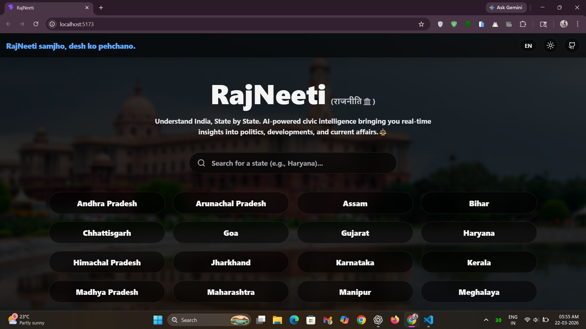
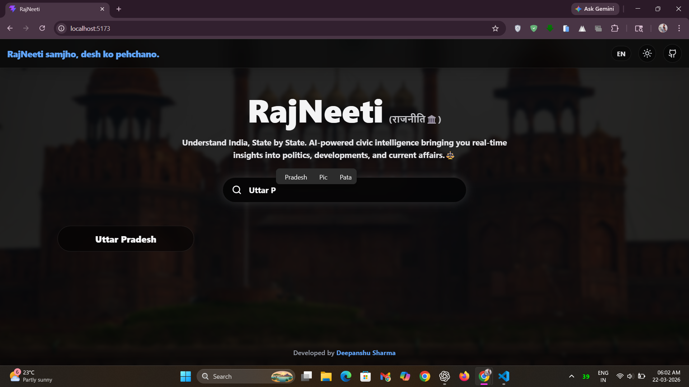
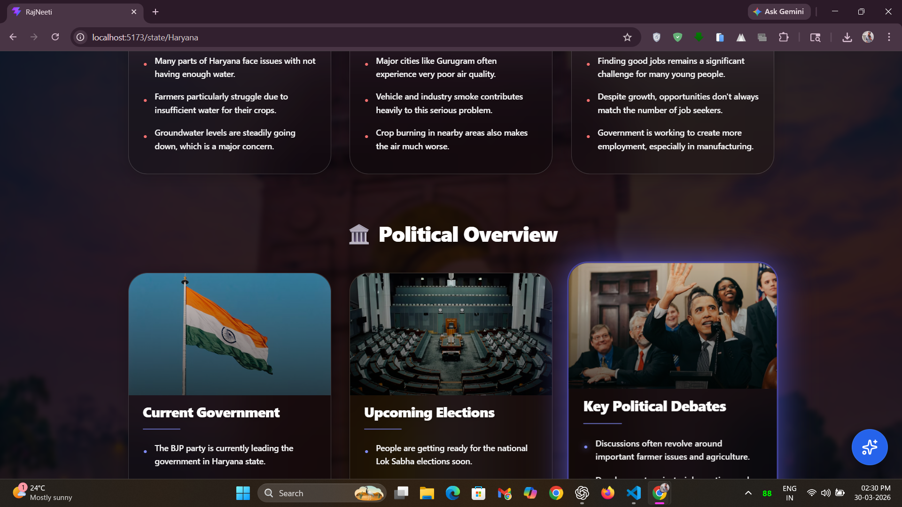
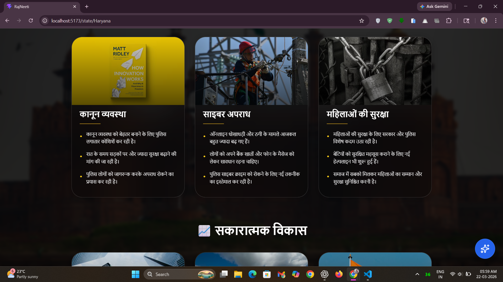
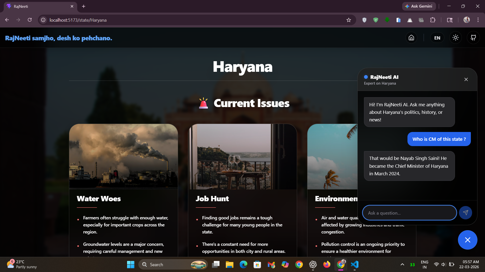
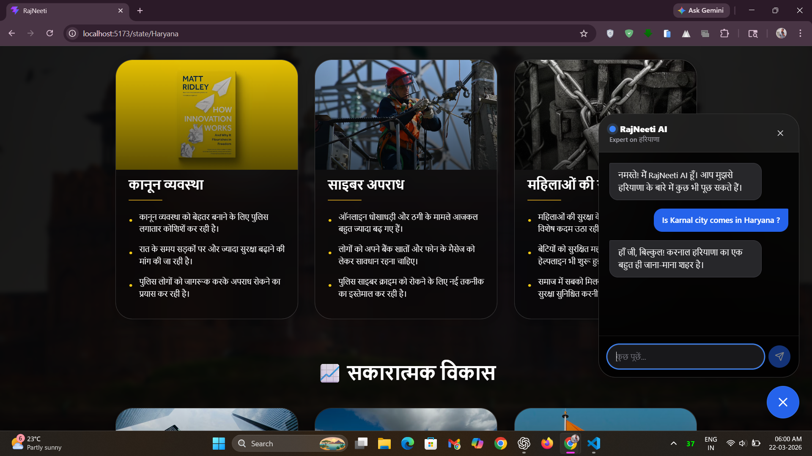
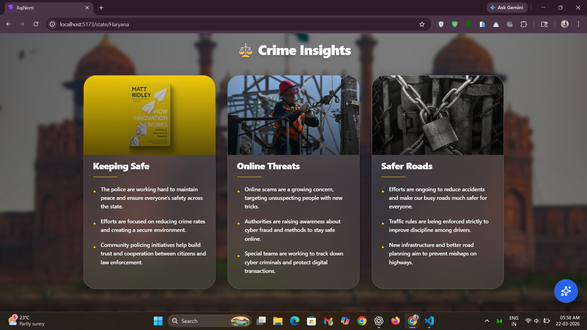
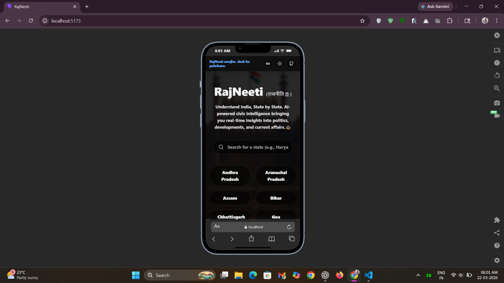

# 🏛️ RajNeeti - Civic Intelligence Dashboard


> **RajNeeti samjho, desh ko pehchano.**

- RajNeeti is an AI-powered civic intelligence platform designed to simplify how people understand Indian states, 
  politics, and real-world issues.  
- It transforms complex, scattered information into clean, structured, and easy-to-digest insights using modern UI 
  and intelligent AI pipelines.

🌐 Live Demo : [View Live](https://rajneeti.vercel.app/)  

## 🚀 Unique Features

### 🧠 Civic Intelligence Engine
RajNeeti is not just a dashboard — it’s a **state-aware AI ecosystem**.

- 🤖 **RajNeeti AI Chat Assistant**  
  Context-aware chatbot that understands which state you’re viewing and responds with relevant insights.

- ⚡ **Dual AI Pipeline**  
  Separate API flows for:
  - Dashboard data generation  
  - Chatbot interaction  
  → Ensures reliability, speed, and no rate-limit issues.

- 🛡️ **Contextual Guardrails**  
  AI is restricted to civic topics only, preventing irrelevant or misleading responses.

- 🌐 **Bilingual Simplicity (EN ⇄ Hindi)**  
  Content is generated in simple English and easy Hindi for maximum accessibility.  
  We also support **English ↔ Hindi translation**, allowing users to seamlessly switch and understand information in their preferred language.

## ✨ Features Breakdown

- 🚨 **Current Issues**  
  Quick highlights of major challenges like unemployment, infrastructure, and environment.

- 🏛️ **Political Overview**  
  Simplified explanation of power structure, governance, and leadership.

- ⚖️ **Crime Insights**  
  Snapshot of law & order trends.

- 📈 **Positive Developments**  
  Growth, reforms, and success stories.

- 🎨 **Glassmorphism UI**  
  Clean, modern design with blur effects and smooth transitions.

- 📱 **Fully Responsive Experience**  
  Works seamlessly across mobile, tablet, and desktop.

## ✅ Advantages

- ⚡ **Fast & AI-driven insights**
- 🧾 **Structured bullet-point data (no long paragraphs)**
- 🧠 **Easy to understand for any age group**
- 🎯 **Focused, distraction-free information**
- 🌙 **Dark mode optimized UI**

## 🧩 Problem This Project Solves

### ❌ The Problem
Political and state-level information in India is:
- Scattered across platforms  
- Filled with jargon  
- Hard to consume quickly  

### ✅ The Solution
RajNeeti:
- Consolidates everything in one place  
- Uses AI to summarize information  
- Presents it in a clean, visual format  

👉 Understand any state in **under 60 seconds**

## 📸 Screenshots

### 🏠 Home Page
  
*Explore Indian states with a clean and intuitive interface.*

### 🔍 Search & Navigation
  
*Quickly find any state with smooth and responsive search.*

### 📊 State Insights Dashboard
  
*English Dashboard - View structured insights including issues, politics, crime, and developments.*

  
*Hindi Dashboard - मुद्दों, राजनीति, अपराध और विकास से जुड़ी जानकारी को संरचित रूप में देखें।*

### 🤖 AI Chat Assistant
  
*Chatbot in English - Interact with the AI assistant to get real-time civic insights in English.*

  
*Chatbot in Hindi - AI चैटबॉट से हिंदी में जानकारी प्राप्त करें और अपने राज्य को बेहतर समझें।*

### 🔆 Light Mode UI
  
*Experience a visually appealing light theme for better readability.*

### 📱 Responsive Design
  
*Fully optimized layout for mobile, tablet, and desktop devices.*

## 🛠️ Tech Stack & Tools

- **Frontend:** React + Vite  
- **Styling:** Tailwind CSS  
- **Animations:** Framer Motion  
- **AI Engine:** Google Gemini (Flash model)  
- **Routing:** React Router DOM (v7.2.0)  
- **Markdown Rendering:** React Markdown  
- **Icons:** Lucide React  
- **State & Storage:** Local Storage API (browser-native storage for persisting data)  
- **CSS Tooling:** Autoprefixer & PostCSS (ensure Tailwind works across all modern browsers)  
- **Code Quality:** ESLint (for identifying and fixing issues in JS/JSX code)  
- **Deployment:** Vercel  

## ⚙️ Setup Instructions

### 1. Clone Repository
```bash
git clone https://github.com/deepanshu1420/RajNeeti.git
cd RajNeeti
```

### 2. Install Dependencies
```bash
npm install
```

### 3. Environment Variables
Create a `.env` file in your root directory & Add: 
```bash
VITE_GEMINI_API_KEY=your_1st_gemini_api_key
VITE_CHATBOT_API_KEY=your_2nd_gemini_api_key
```

### 4. Run Project     
```bash
npm run dev
```

### 5. Open in Browser
```bash
http://localhost:5173
```

